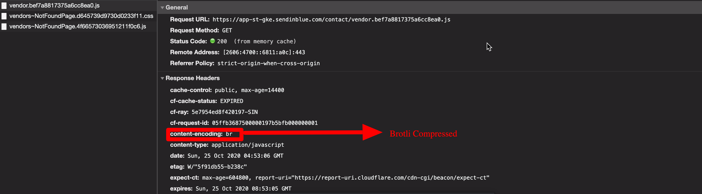

### What is Brotli
**Brotli** is also a compression algorithm. It is developed by Google and serves best for text compression. 
It is supported by all major browsers.


### Problem Statement
How to enable react apps to serve brotli compressed files when served through Nginx with a fallback to Gzip

It's a two step process

- Generate Brotli and Gzip compressed version of files using webpack. 
- Serve correct version of files when requested over a network.

Node 10.16.0 and later has native support for Brotli compression in its zlib module.

**Webpack configuration**

```javascript
 plugins: [
    new CompressionPlugin({
      filename: '[path][base].gz',
      algorithm: 'gzip',
      test: /\.js$|\.css$|\.html$/,
      threshold: 10240,
      minRatio: 0.8,
    }),
    new CompressionPlugin({
      filename: '[path][base].br',
      algorithm: 'brotliCompress',
      test: /\.(js|css|html|svg)$/,
      compressionOptions: {
        level: 11,
      },
      threshold: 10240,
      minRatio: 0.8,
    }),
  ]
```

**Nginx Conf**

```js
# gzip
gzip on;
gzip_vary on;
gzip_proxied any;
gzip_comp_level 6;
gzip_types text/plain text/css text/xml application/json application/javascript application/xml+rss application/atom+xml image/svg+xml;

# brotli
brotli on;
brotli_comp_level 6;
brotli_types text/xml image/svg+xml application/x-font-ttf image/vnd.microsoft.icon application/x-font-opentype application/json font/eot application/vnd.ms-fontobject application/javascript font/otf application/xml application/xhtml+xml text/javascript  application/x-javascript text/plain application/x-font-truetype application/xml+rss image/x-icon font/opentype text/css image/x-win-bitmap;

```

> That’s it. Those few lines enables the Brotli compression with fallback to the Gzip compression for all the static resources of your website.

### Does your browser support Brotli?
Browsers which support Brotli send ‘br’ along with ‘gzip’ in accept-encoding request header. If Brotli is enabled on your web server, you will get response in Brotli compressed format.

 

### Performance Metrix
* Bundle Size is reduced 30 to 35% compared to normal js file and 12 to 15% reduced when compared to Gzip file.

 