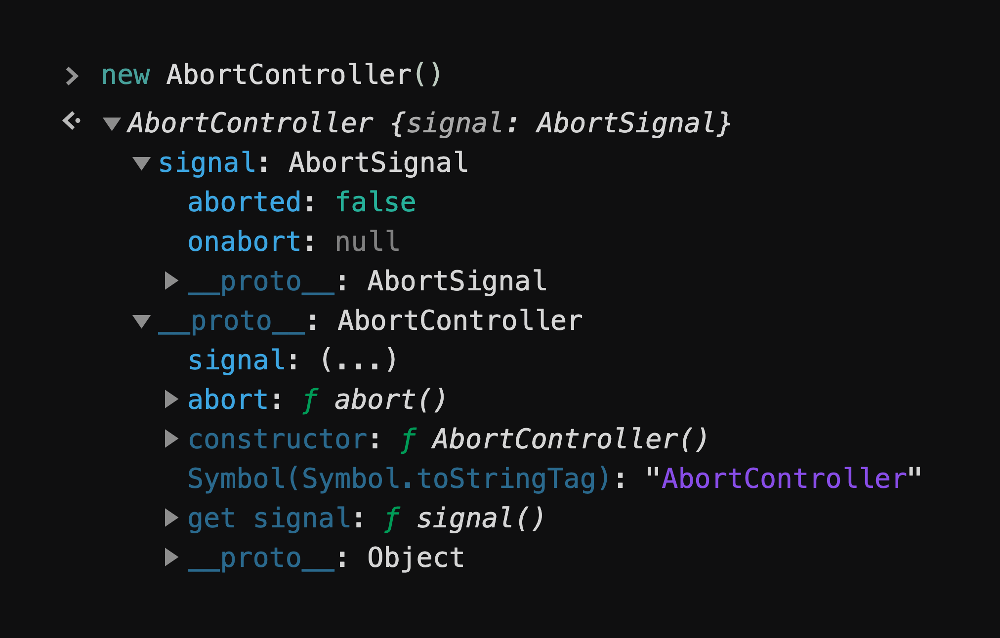

`AbortController` is used to abort a fetch request. [Check out this demo](#demo).

As of today, there are two primary ways to make a request in the browser. `XMLHttpRequest` and `fetch`.
`XMLHttpRequest` existed in browsers for a long time. the `fetch` was introduced with `ES6`.

`XMLHttpRequest` was always abortable. An abortable `XHR` request looks something like this.

```javascript
let xhr = new XMLHttpRequest();
xhr.method = 'GET';
xhr.url = 'https://slowmo.glitch.me/5000';
xhr.open(method, url, true);
xhr.send();

// Abort the request at a later stage
abortButton.addEventListener('click', function() {
  xhr.abort();
});
```

`fetch` wasn't abortable when it was initially introduced.
the [initial GitHub issue for aborting a fetch request][abort fetch issue] was opened initially in 2015.
There were also many attempts to solve this problem outside of the `fetch` spec
like [cancelable-promises][cancelable-promises-github] and other [hacks][cancelable-promise-hack].

But, we now finally have the generic [`AbortController`][abort controller MDN] and the `AbortSignal` APIs.
These APIs are provided by the [DOM standard][DOM standard], not by the language itself.

## What is an AbortController?



As described in the [DOM spec documentation][DOM standard]

> Though promises do not have a built-in aborting mechanism, many APIs using them require
> abort semantics. `AbortController` is meant to support these requirements by providing an `abort()`
> method that toggles the state of a corresponding `AbortSignal` object. The API which wishes to
> support aborting can accept an `AbortSignal` object, and use its state to determine how to proceed.

```js
// Create a instance of the AbortController
const controller = new AbortController();
const signal = controller.signal;

// Listen for abort signal, callback executed on controller.abort()
signal.addEventListener('abort', () => {
  console.log(signal.aborted); // true
});

// Abort at a later stage, this will notify the signal
controller.abort();
```

## How to abort fetch request using AbortController?

`fetch` accepts `AbortSignal` as part of the second argument.

```js
const controller = new AbortController();
const signal = controller.signal;

// API responds after 5s
// Note the 'signal' in the second argument
fetch('https://slowmo.glitch.me/5000', { signal })
  .then(r => r.json())
  .then(response => console.log(response))
  .catch(err => {
    if (err.name === 'AbortError') {
      console.log('Fetch was aborted');
    } else {
      console.error('Oops!', err);
    }
  });


// Abort the request after 2s
// This will abort the fetch with 'AbortError'
setTimeout(() => {
  controller.abort();
}, 2000);
```

Aborting the `fetch` aborts both the request and response.
The request fails with the error `new DOMException('Aborted', 'AbortError')`.

> The same `AbortSignal`(`signal` in the above example) can be used to abort multiple `fetch` requests.


## Demo

https://codesandbox.io/s/abortable-fetch-using-abortcontroller-yd07c

> `AbortController` is not only for fetch. it’s a generic API to abort asynchronous tasks.
> Eg: You can use it to [implement a cancelable promise][cancel promise].

## Browser support and polyfill

<CaniuseEmbed featureName="abortcontroller" />

Many older browsers don't [support][abortcontroller caniuse] the `AbortController` and the `AbortSignal` APIs.
You can use either of these polyfills to make it work.

https://www.npmjs.com/package/abort-controller
https://www.npmjs.com/package/abortcontroller-polyfill

That's it for now. If you enjoyed reading this post, give me a follow [@ganapativs](https://twitter.com/ganapativs) 😬

---

**References:**

- [https://developers.google.com/web/updates/2017/09/abortable-fetch](https://developers.google.com/web/updates/2017/09/abortable-fetch)
- [https://github.com/whatwg/fetch/issues/27](https://github.com/whatwg/fetch/issues/27)

**Thanks:**

- [Photo by Cherry Laithang on Unsplash](https://unsplash.com/photos/NmPpz1jA_JE)

---

[abort fetch issue]: https://github.com/whatwg/fetch/issues/27
[cancelable-promises-github]: https://github.com/tc39/proposal-cancelable-promises
[cancelable-promise-hack]: https://github.com/whatwg/fetch/issues/27#issuecomment-267483591
[cancel promise]: https://egghead.io/lessons/react-cancel-a-promise-using-abortcontroller
[DOM standard]: https://dom.spec.whatwg.org/#aborting-ongoing-activities
[abort controller MDN]: https://developer.mozilla.org/en-US/docs/Web/API/AbortController
[abortcontroller caniuse]: https://caniuse.com/#feat=abortcontroller
